# Lab 1: Serving a static website using Python and FastAPI


## Introduction

In this lab you will build a simple web application using Python and the **[FastAPI](https://fastapi.tiangolo.com/)** framework. The application will serve a simple static web site built using HTML, CSS, and JavaScript.


## 1. Setting Up

### 1.1 Open VS Code

If you don't already have one, create folder named **`webapps`** in your Home folder, on an external USB disk, etc. 

Open your **`webapps`** folder and create a new folder for this exercise, name it **`lab1`**

Then open the **`lab1`** folder in VS Code. ***Note: always open your application folder and not individual files in VS Code*** 

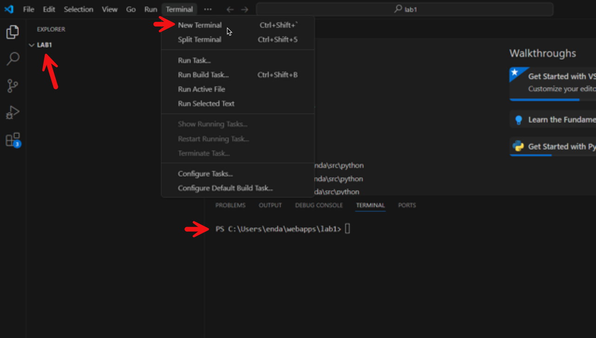


### 1.2 Setup a new Python FastAPI application

##### 1.2.1. Before starting, verify that Python is installed. 

Open a **New Terminal** from the `Terminal` menu in VS Code. In the terminal, enter the following command:

```bash
C:\Users\X00000000\webapps\lab1>python --version
Python 3.12.4
```

The installed version, 3.1x.x, should be displayed. If `python` did not work, try `python3`.

##### 1.2.2. Create the application and setup a Python Virtual Environment in the current directory `webapps/lab1`

A virtual environment keeps your applications seperate from the default Python install. This prevents conflicts (for example if a system dependency is changed or deleted) and ensures portability between systems (for example when deploying the application to a remote server).

```bash
C:\Users\X00000000\webapps\lab1>python -m venv venv --prompt="lab1"
```

##### 1.2.3. Activate the Python Virtual Environment

In Windows (i.e. computing labs):

If using **PowerShell** in Windows,  use the following command

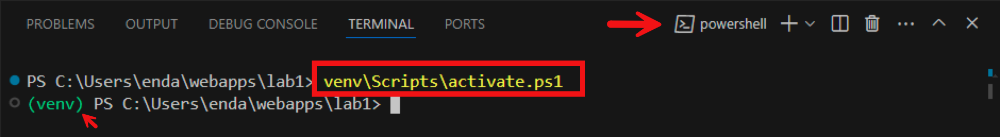

You *may* see a permissions error, if you do, execute the following command to set the execution policy:

```bash
C:\Users\X00000000\webapps\lab1>Set-ExecutionPolicy -Scope CurrentUser
```

If using a **cmd shell** in Windows, use this command to activate:

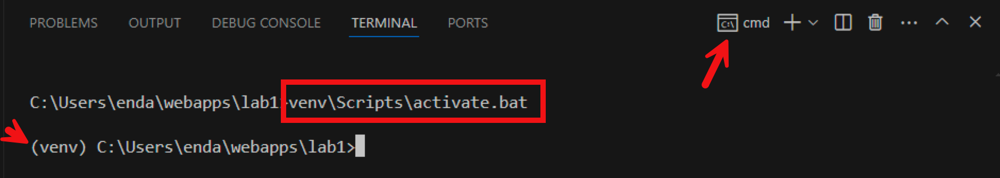

In **Linux or MacOS**, activate using:

```bash
$ source ./venv/bin/activate
```

Make sure to run the `deactivate` command when you are finished working on your appliction, otherwise your `venv` iinstance could be used by another application.

##### 1.2.4. Install dependencies

```bash
C:\Users\X00000000\webapps\lab1>pip install fastapi uvicorn['standard'] jinja2 python-multipart 
```

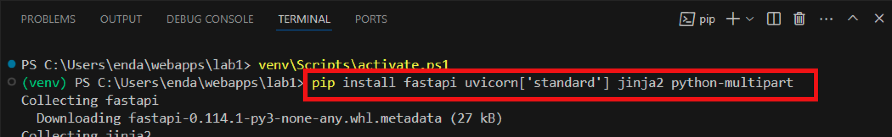

The install process may take a few minutes, look out for any notifications and take the recommended action, e.g.

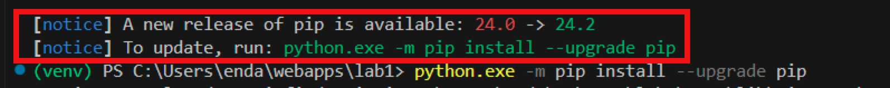


## 2. Create the Web Application

Our first application will perform the following basic operations of a web app:

1. Listen for requests.
2. When a HTTP GET `request` is recieved for the site root **`/`** the default page, `index.html` will be sent in an HTTP `response`.

To make this work we will need to:

1. Define a web server, with the help of `FastAPI`.
2. Define an `endpoint` to handle requests for the site root `/` and respond with content - `index.html`
3. Define 


#### 2.1 Add a new folder, named **`app`** to `lab1`. This will contain the web application files.

At this point the `lab1` folder contains a subfolder named `venv` and nothing else. The `venv` folder contains the Python **virtual environment** including all  dependencies reuired to support the application.

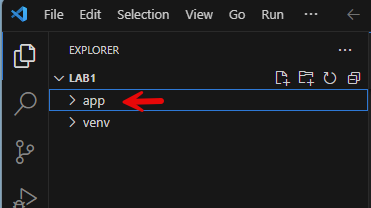

#### 2.2 Add `main.py` to the app folder

**`main.py`** will be the first file exected in our `FastAPI` web application. Add the following Python code to **`main.py`**. Read the code comments for details.

```python
# import dependencies
from fastapi import FastAPI, Request
from fastapi.responses import HTMLResponse
from fastapi.staticfiles import StaticFiles
from fastapi.templating import Jinja2Templates

# create app instance
app = FastAPI()

# set location for templates
templates = Jinja2Templates(directory="app/view_templates")

# handle http get requests for the site root /
# return the index.html page
@app.get("/", response_class=HTMLResponse)
async def index(request: Request):
    return templates.TemplateResponse(request=request, name="index.html")

```

It is recommended to install following Python extensions in VS Code to add support for the language.


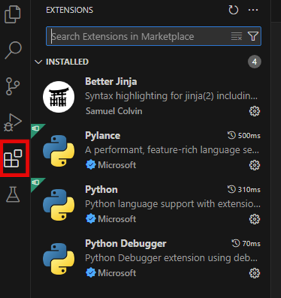


#### 2.3 Add `index.html` to the application

You should notice that `main.py` assigns a directory path to the **`templates`** variable. The directory **`view_templates`** will be used as the location for HTML [Jinja2 Templates](https://pypi.org/project/Jinja2/).

You will also see a block starting with `@app.get("/", reponse_class=HTMLResponse`. This defines how to handle requests for the root directory of the application from a web client or browser. The function returns an HTML response based on the contents of a files named `index.html` from the templates folder.

Add a new folder named **`view_templates`** to the existing `app` folder.  The add a new file named **`index.html`** to view_templates.

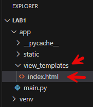

Open `index.html` in VS Code and add some HTML, start with the `html:5` Emmet abbreviation, then add a H1 element, something like this example:

```html
<!DOCTYPE html>
<html lang="en">
<head>
    <meta charset="UTF-8">
    <meta name="viewport" content="width=device-width, initial-scale=1.0">
    <title>Home</title>
</head>
<body>
    <h1>Hello World</h1>
</body>
</html>
```

 

## 3. Run the application and test

Use the following command to start the web application in a VS Code terminal:

```bash
C:\Users\enda\webapps\lab1> uvicorn app.main:app --reload
```

You must be in the correct folder for this to work so that the path to `main.py` can be found. The `--reload` switch causes the application to restart if changes are made to the application files - very useful when developing.

After running the command you should see output similar to:

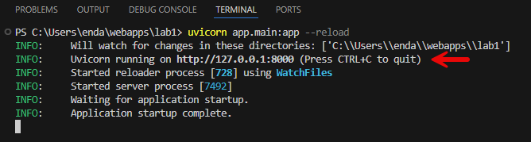

Get familiar with this output as it contains important information about the running application, including any errors which need to be resolved.

If the application started successfully, you will see an info line stating which IP address and TCP port it is running on. in this case, **`http://127.0.0.1:8000`**

Try this in a web browser, note that `localhost` can be used as an alias for 127.0.0.1.

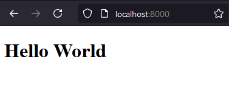 


## 4. Adding static content

At this point we have a very simple web application which returns the content of `index.html` when the site root `/` is requested, but how do we incide static content such as images, css, and JavaScript in the page?

The easiest way is to make use of the `StaticFiles` library imported in `main.py`. This will make it easy to access content from a folder of our choice in the `app`.

Start by adding a new folder named `static` in the `app` folder. The create further subfolders for css, js, and images.

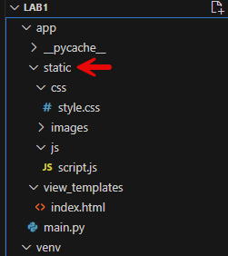

The folder can then be 'mounted' in `main.py` by adding the following at the end of the file:

```python
app.mount(
    "/static",
    StaticFiles(directory="app/static"),
    name="static",
)
```

Test by linking a css and script from `index.html`

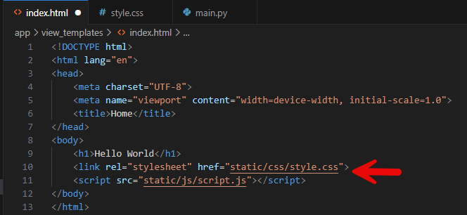

 

Add a stye to set the color of H1 elements to red, then reload the page:

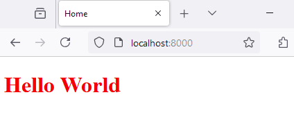


## 5. Exercises

1. Add two more HTML pages and routes to the application, e,g. `about.html` and `contact.html`. The static folder should not be used for these new pages!

2. Add navigation links to move between the pages.

3. Add the latest Bootstrap libraries to the pages using the CDN links from https://www.bootstrapcdn.com/.

4. Add some content to the pages and style using Bootstrap, including the navigation menus.

   
